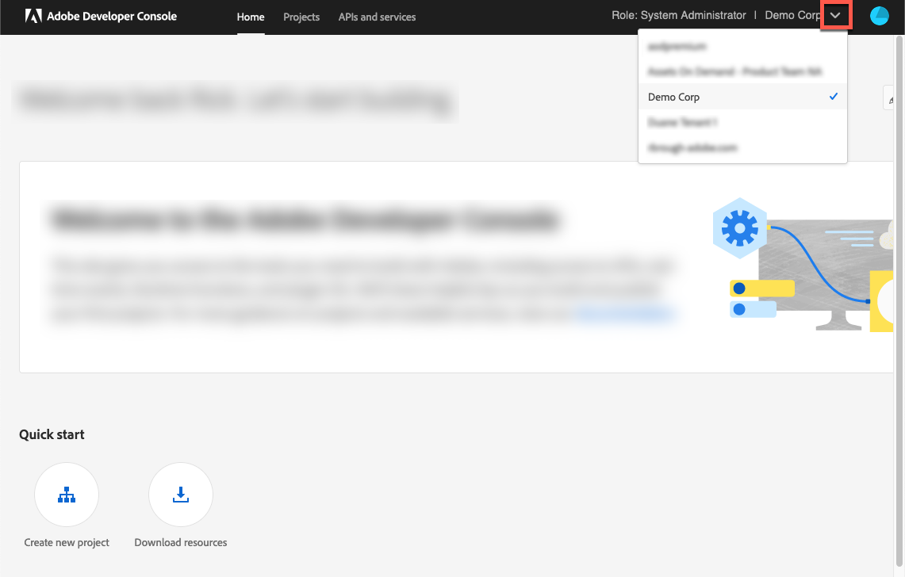

# 登入Adobe Analytics{#log-in-to-adobe-analytics}

確認您是Adobe Analytics中「Web服務存取」群組的成員。 請在登入前完成設定Adobe Analytics報表，並將Adobe Analytics報表變數與Adobe Dynamic Media Classic事件比對。 此群組中的成員可以存取指定報表套裝中的所有報表。 無論介面中設定的許可權為何，都使用Experience Cloud的網站服務API來執行此操作。 若要新增成員到群組，請在Adobe Analytics中移至&#x200B;**[!UICONTROL 管理工具]** > **[!UICONTROL 使用者管理]** > **[!UICONTROL 編輯群組]**。

登入時，您可以選擇輸入Experience Cloud組織ID，使用最新的視訊分析實作。 如果您選擇不輸入ID，視訊報表仍可運作。 但是，它可能會導致資料無法正確與Adobe Dynamic Media Classic外部該使用者端的其他資料整合。

>[!NOTE]
>
>如果您的Adobe Analytics帳戶已移轉至Adobe IMS驗證(Identity Management系統)以進行登入，則無法輸入直接憑證。

## 從Adobe Dynamic Media Classic登入Adobe Analytics {#log-in-to-analytics-from-dmc}

首先，請整合Dynamic Media Classic與Adobe Analytics OAuth。 Adobe Analytics OAuth與Dynamic Media Classic的整合通常每個使用者只需完成一次。

1. 存取[Adobe Developer Console](https://developer.adobe.com/console)。 確保您的帳戶擁有需要整合之組織的管理員許可權。
1. 在「首頁」右上角附近，從下拉式清單中選取適當的公司。 （下面的熒幕擷圖僅供參考；您選取的實際公司名稱可能會有所不同。）

   

1. 執行下列任一項作業：

   * 在頁面頂端，從&#x200B;**[!UICONTROL 首頁]**&#x200B;索引標籤，選取&#x200B;**[!UICONTROL 建立新專案]**。
   * 在頁面頂端的&#x200B;**[!UICONTROL 專案]**&#x200B;索引標籤。 在頁面的右角附近，選取&#x200B;**[!UICONTROL 建立新專案]**。

1. 在專案的頁面上，選取&#x200B;**[!UICONTROL 新增API]**。
1. 在&#x200B;**[!UICONTROL 新增API]**&#x200B;頁面上，選取&#x200B;**[!UICONTROL Adobe Analytics]**。
1. 在頁面的右下角附近，選取&#x200B;**[!UICONTROL 下一步]**。

   

1. 在&#x200B;**[!UICONTROL `Configure API`]**&#x200B;頁面上，選取&#x200B;**[!UICONTROL 使用者驗證OAuth]**。
1. 在頁面的右下角附近，選取&#x200B;**[!UICONTROL 下一步]**。
1. 在&#x200B;**[!UICONTROL `Configure API`]**&#x200B;頁面上，選取&#x200B;**[!UICONTROL OAUTH 2.0 Web]**。
1. 在&#x200B;**[!UICONTROL 預設重新導向URI]**&#x200B;文字欄位中，完全輸入下列路徑：

   `https://exploreadobe.com/dynamic-media-upgrade/`

1. 在&#x200B;**[!UICONTROL 重新導向URI模式]**&#x200B;文字欄位中，完全輸入下列路徑：

   `https://exploreadobe\.com/dynamic-media-upgrade/`

1. 在頁面的右下角，選取&#x200B;**[!UICONTROL 儲存已設定的API]**。
1. 在導覽面板中，在Adobe Analytics頁面的左側，**[!UICONTROL 認證]**&#x200B;底下，選取&#x200B;**[!UICONTROL OAuth Web]**。
1. 在&#x200B;**[!UICONTROL 認證詳細資料]**&#x200B;底下，執行下列動作：
   * 在&#x200B;**[!UICONTROL 使用者端識別碼]**&#x200B;下，選取&#x200B;**[!UICONTROL 複製]**&#x200B;以複製值。 您需要此值才能在後續的Dynamic Media Classic案頭應用程式中進行後續Analytics設定。
   * 在&#x200B;**[!UICONTROL 使用者端密碼]**&#x200B;下，選取&#x200B;**[!UICONTROL 擷取使用者端密碼]**&#x200B;以顯示相關的值。 選取&#x200B;**[!UICONTROL 複製]**&#x200B;以複製值。 您需要此值才能在後續的Dynamic Media Classic案頭應用程式中進行後續的Adobe Analytics設定。

## 在Adobe Dynamic Media Classic中設定Adobe Analytics {#configure-analytics-in-dmc}

>[!NOTE]
>
>在Dynamic Media Classic中進行Adobe Analytics的初始設定後，只有以下情況是您必須重做設定的時間：
>
>* Analytics新增了新報表，使用者想要開始傳送資料至該新報表。
>* Adobe Analytics中的追蹤伺服器已更新。
>* 報表中引進了新的追蹤變數，您希望將Dynamic Media Classic使用者介面中的特定檢視器變數連結至該新Analytics變數。
>

1. 在Adobe Dynamic Media Classic案頭應用程式的右上角附近，前往&#x200B;**[!UICONTROL 設定]** > **[!UICONTROL 應用程式設定]**。
1. 在左側面板的&#x200B;**[!UICONTROL 應用程式設定]**&#x200B;下，選取&#x200B;**[!UICONTROL Adobe Analytics]**。
1. 在&#x200B;**[!UICONTROL Adobe Analytics設定]**&#x200B;頁面上，選取&#x200B;**[!UICONTROL Adobe Analytics登入]**。
1. 在&#x200B;**[!UICONTROL Adobe Analytics登入]**&#x200B;對話方塊的&#x200B;**[!UICONTROL 使用者端識別碼]**&#x200B;欄位和&#x200B;**[!UICONTROL 使用者端密碼]**&#x200B;欄位中，貼上您先前複製的個別值。
1. 在對話方塊的右下角，選取&#x200B;**[!UICONTROL 登入]**&#x200B;並執行您的Adobe IMS (Identity Management服務)登入。

   當您成功登入時，「Adobe Analytics登入」對話方塊會再次出現，並顯示&#x200B;**[!UICONTROL 公司]**&#x200B;下拉式清單，由您可用的公司啟動。

1. 從&#x200B;**[!UICONTROL 公司]**&#x200B;下拉式清單中選擇公司。

   選取公司後，所選公司可用的報表套裝所起始的&#x200B;**[!UICONTROL 套裝]**&#x200B;下拉式清單會變成可見。

1. 從&#x200B;**[!UICONTROL 套裝]**&#x200B;下拉式清單中選擇報表套裝。

   >[!NOTE]
   >
   >依預設，使用者必須瞭解&#x200B;**[!UICONTROL COMPANIES]**&#x200B;和&#x200B;**[!UICONTROL SUITES]**&#x200B;下拉式清單都是空的。 因此，使用者必須從每個清單中選取一個值。

1. 選取「**[!UICONTROL 確定]**」以儲存組態。

   >[!NOTE]
   >
   >當您選取「**[!UICONTROL 確定]**」時，**[!UICONTROL Adobe Analytics伺服器]**&#x200B;欄位會填入符合分析名稱空間的建議協力廠商追蹤伺服器。 如果您使用不同的追蹤伺服器，請在此欄位中更新它以避免資料遺失。

1. 在「Adobe Analytics設定」頁面的左下角，選取「**[!UICONTROL 儲存]**」以確保您的Adobe Analytics帳戶設定已更新。

>[!MORELIKETHIS]
>
>* [設定Adobe Analytics報表](configuring-analytics-reports.md#configuring_adobe_analytics_reports)
